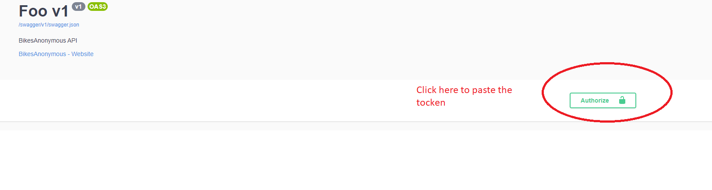
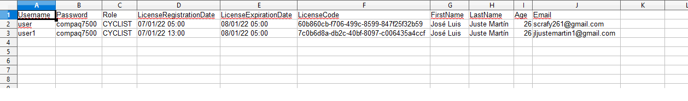

# BikesAnonymous

### [1. Proyect description](#desc)

### [2. Layers description](#lay_desc)

### [3. How to start the application](#start)

### [4. Invoking methods using swagger UI](#invoke)

### [5. Criteria of acceptance](#acceptance)

1.  Cyclist authenticates]
2.  Cyclist prints his cyclist큦 license]
3.  Owner loads cyclist data into DB]
4.  Owner authenticates](#own_auth)
5.  Owner gets last cyclists registered report by email](#report)
6.  Owner creates his own account](#create)   

### 

### 1. Proyect description

 

Bike Anonymous is an integral management platform which allows an administrator / owner of the same to carry out the management of federated cyclists. 
Through the platform, the administrator / owner will be able to perform various actions such as creating their own account, registering federated cyclists, obtaining a report via email of the registered cyclists on the last night, etc ...  
This platform will also allow federated cyclists to download their license on the fly so that in case they need it urgently, they can have it.
In short, it is a comprehensive management platform. 
This application has been programmed trying to respect SOLID principles.

 
 

### 

### 2. Layers description  

- Domain/core 

  
This layer represents our domain, our main entities. 
  Here we name our business, for example, what is a cyclist, what is an owner, what properties should they have, etc ... 
  Normally we will find an entity for each table in our database and they will have the same validation rules as the fields in the database. 
  Defining this layer correctly is very important since we will build our application on the data model that we define here. 
  All data that comes from outside our system and enters it, if it is necessary to store it, will have to be converted to a model of our domain and pass the validation rules that we have defined, otherwise, said information must be rejected. 
  With this we avoid contaminating our database with spurious data and incidentally avoid errors in our application.

   

- DataLayer/DataAcces 
    
This layer represents data access. 
    Defining this layer is a correct idea in the sense that it abstracts us from how we obtain the data in our application. 
    For example, if we used an ORM as an entity framework, we could define a new project with all the configuration of the entity framework and its entities and through this layer use all the power of the entity,
    or conversely, you could decide to use an object-oriented database like MongoDB. 
    For this example we have used plain text json files as the data storage system, but if we wanted to change it, we would simply have to reprogram only this layer, not affecting the rest of the application layers. 
    The important idea or concept to understand here is that we abstract ourselves into a data access layer, we can rest assured if in the future we want to change the data persistence system of our application since we will only have to work on this layer. 
    It is an essential condition that this layer works only with the models of our domain, that is, all the methods of ALL the interfaces that are programmed in this layer must receive models of our domain for both reading and writing operations.

   

- Infraestructure 
  
This layer represents our transversal services, that is, common services that can be used from the other layers, except from our core / domain layer, which should not have references to the other projects in the solution. 
  Typically you will have few references to the other projects in the solution. 
  In the case of our application, here we have programmed various services such as: TokenGenerator, service for sending emails, the generator of documents in pdf format, etc ...

   

- Application 
  

  This layer is where we will program the application commands or the well-known use cases. 
  We will have one command per action. 
  Normally I usually group the commands in separate projects, such as all the commands that an owner can execute would go in one project, the commands that a cyclist can execute would go in another project and so on. 
  It is really here, relying on the other cups where we program our business logic, for example, if we need to create an owner we will invoke the createOwner command and this command will rely on the repository layer to store data. 
  We try to respect the Single Responsibility principle, one command per action.

   
- Presentation 
  
This layer, as its name suggests, is the one that presents the data to the outside and receives the data from the outside. 
  It is the entry and exit point to our data system. 
  Normally, the other projects in the application should not have references to this project. 
  All the inputs that we receive from the outside, if they are going to be stored in our database, they must be converted to a model of our domain because as we said before, our application layer (our commands) can only receive models from our domain to pass them on to the repository layer. 
  With this we ensure that spurious data does not enter our system. 
  If, for example, it were necessary to perform a read operation through a specific command to return a data model that is not representable through our domain models, our command could simply read through the repository layer the entities we need and then perform a data projection to adapt the output to what the presentation layer needs. 
  This is known as DTO data models (data transfer objects).

 
 

### 

### 3. How to start the application

 

First of all you have to have [Visual Studio](https://visualstudio.microsoft.com/es/thank-you-downloading-visual-studio/?sku=Community&rel=17) IDE installed in your computer, then, once you have done it, you have to clone the project from [here](https://github.com/scrafy/BikesAnonymous.git).

Go to the project folder a double click on BikesAnonymous.sln solution file and the project will be opened in Visual Studio.
After that, if you want to execute the application, click on the green play button which is placed on top of the IDE큦 window and a swagger interface will be showned automatically in order to you can invoke the backend methods and enjoy with this wonderfull application :)
 
 

### 

### 4. Invoking methods using swagger UI

 
Invoking methods using Swagger interface is very easy. The first thing you have to do it큦 to create your owner account, for this, you have to select the action /api/owner and fill the data. 
Once you have created your owner account, you will be able to do login invoking api/owner/authenticate action using your credentials and you will get a session token. 
Then, copy this token from the response section and paste it on authorize screen. 
 

After that, you will be able to invoke all owner큦 action (not cyclist큦 actions) because the session token defines which rol can execute a concrete action on controllers. 
The next step would be to load csv file with the cyclist accounts. 
Try your csv is equal showned here else, the parser will throw an exception. 
 

Once, the cyclist account have been created, they will get theirs licenses by email and any cyclist loaded will be able to do login in the application. 
For that, make login with one of cyclist큦 account, copy the session token, go to the authorize green button on top and paste it. 
Then, call api/cyclist/printlincense and swagger will show you a link to download your license document.
